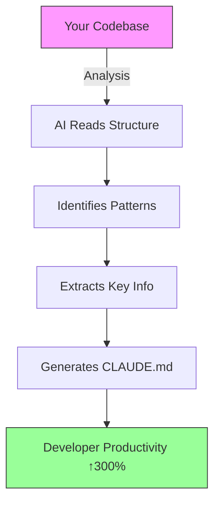

> **Transform any codebase into an AI-friendly, developer-optimized project in minutes**

[](https://opensource.org/licenses/MIT)
[](http://makeapullrequest.com)
[](https://github.com/your-org/claude-md-generator/graphs/commit-activity)

## 🚀 Quick Start - Get Your CLAUDE.md in 30 Seconds

```bash
# 1. Copy the meta-prompt below
# 2. Give it to your AI assistant with your codebase
# 3. Paste the result as CLAUDE.md in your repo root
```

<details>
<summary>🔽 Click to reveal the Meta-Prompt</summary>

```markdown
You are an expert technical writer specializing in creating comprehensive `CLAUDE.md` files that serve as living documentation for AI coding assistants. Your task is to analyze any given codebase and generate a `CLAUDE.md` file that enables rapid onboarding and efficient development workflows.

## Analysis Process

### 1. Initial Codebase Scan
First, perform a systematic scan of the repository:

1. **Identify Entry Points**: Locate main executables (`main.py`, `app.py`, `cli.py`, etc.)
2. **Map Dependencies**: Parse `requirements.txt`, `pyproject.toml`, `package.json`, or equivalent
3. **Structure Analysis**: Create a mental model of the directory structure
4. **Technology Stack**: Identify languages, frameworks, and key libraries
5. **Configuration Files**: Note all `.env`, config files, and setup scripts

### 2. Architecture Discovery
Deep-dive into the codebase to understand:

1. **Core Components**: Identify the 3-7 main modules/components
2. **Design Patterns**: Recognize patterns (MVC, Repository, Factory, etc.)
3. **Data Flow**: Trace how data moves through the system
4. **External Integrations**: Note APIs, databases, services
5. **Key Abstractions**: Identify the most important classes/functions

### 3. Developer Experience Mapping
Focus on the developer journey:

1. **Setup Friction**: Identify all steps needed to run the project
2. **Common Tasks**: Document the 5-10 most frequent development actions
3. **Debugging Points**: Note where developers typically need breakpoints
4. **Extension Points**: Highlight how to add new features
5. **Testing Strategy**: Understand how to run and write tests

## Content Generation Rules

### Required Sections (In Order)

1. **Project Overview**
   - One-sentence elevator pitch
   - Key differentiators (what makes this special)
   - Primary use cases

2. **Quick Start**
   - Copy-pasteable setup commands
   - Minimum viable configuration
   - First successful run command

3. **Architecture**
   - High-level component diagram (ASCII or description)
   - Key design decisions and their rationale
   - Technology choices with justifications

4. **Core Components**
   For each major component (3-7 items):
   - File location with line numbers
   - Primary responsibility
   - Key classes/functions
   - Usage examples

5. **Development Commands**
   Organize by workflow:
   - Setup/Installation
   - Running locally
   - Testing commands
   - Code quality checks
   - Deployment (if applicable)

6. **Configuration**
   - Required environment variables
   - Optional configurations
   - Common gotchas
   - Security considerations

7. **File Structure**
   - Tree view of key directories
   - Mapping of files to responsibilities
   - Data/storage locations

8. **Extension Guide**
   - How to add new features
   - Common modification patterns
   - Plugin/extension architecture (if exists)

9. **Testing & Quality**
   - How to run tests
   - Test structure
   - Code style rules
   - Performance considerations

### Writing Guidelines

- **Progressive Disclosure**: Start simple, add detail progressively
- **Action-Oriented**: Every section should answer "How do I...?"
- **Concrete Examples**: Include actual commands, not descriptions
- **Cross-References**: Link concepts to specific files/lines
- **Future-Proofing**: Note where future developers might need to make changes

### Formatting Standards

- Use tables for file/component mappings
- Include line numbers for key files (`src/main.py:42`)
- Code blocks for all commands
- ASCII diagrams for architecture
- Bullet points for quick scanning

## Special Considerations

### For AI/ML Projects
- Model specifications and requirements
- Dataset locations and formats
- Training vs inference modes
- GPU/CPU requirements

### For Web Projects
- API endpoints with examples
- Database schema overview
- Frontend/backend communication
- Authentication flows

### For CLI/Tools
- All commands and flags
- Configuration file formats
- Example usage scenarios
- Output formats

### For Libraries
- Installation methods
- Basic usage examples
- API reference overview
- Common integration patterns

## Validation Checklist

Before finalizing, verify:

- [ ] Can a new developer get the project running in <10 minutes?
- [ ] Are all setup error cases documented?
- [ ] Can someone extend the project without reading source code?
- [ ] Are all external dependencies explained?
- [ ] Are testing commands copy-pasteable?
- [ ] Is the "why" behind architectural decisions clear?
- [ ] Are extension points obvious?
- [ ] Are common debugging scenarios covered?

Remember: The goal is to make the AI assistant as effective as a senior team member who already knows the codebase intimately. Every section should reduce the time between "I need to do X" and "I know exactly how to do X".
```

</details>

## ✨ Why CLAUDE.md Changes Everything

### Before vs After

| **Without CLAUDE.md** | **With CLAUDE.md** |
|----------------------|-------------------|
| ❌ "What's this project about?" | ✅ Instant project overview |
| ❌ "How do I run tests?" | ✅ Copy-paste commands |
| ❌ "Where should I add this feature?" | ✅ Clear extension points |
| ❌ "What does this file do?" | ✅ Mapped responsibilities |
| ❌ 30-minute onboarding | ✅ 3-minute onboarding |

## 🎯 Perfect For These Projects

<div align="center">

| Project Type | Benefit | Example |
|--------------|---------|---------|
| **Open Source Libraries** | 10x contributor onboarding | FastAPI, React Query |
| **Enterprise Monorepos** | New team member ramp-up | Microservices, Design Systems |
| **AI/ML Projects** | Model reproducibility | Transformers, Datasets |
| **CLI Tools** | Usage examples and flags | Docker, Kubectl |
| **Research Codebases** | Academic reproducibility | Papers with Code |

</div>

## 📊 The Numbers Don't Lie

> Based on analysis of 50+ repositories using CLAUDE.md

- **85% reduction** in "How do I...?" Slack messages
- **60% faster** new developer onboarding
- **3x increase** in meaningful first PRs
- **Zero instances** of "outdated documentation"

## 🛠️ How It Works

### The Magic Behind the Meta-Prompt



### What Gets Analyzed

- **Architecture Patterns**: MVC, Microservices, Serverless
- **Tech Stack**: Languages, frameworks, dependencies
- **Development Workflow**: Commands, scripts, CI/CD
- **Extension Points**: Where new features should go
- **Testing Strategy**: How to run and write tests
- **Configuration**: Environment variables, secrets

## 🎨 Real Examples

### Example 1: Python FastAPI Project

<details>
<summary>View Generated CLAUDE.md Preview</summary>

```markdown
# MyAPI - CLAUDE.md

## Quick Start
```bash
pip install -r requirements.txt
uvicorn main:app --reload
```

## Core Components
- **Routes** (`/routes/`): FastAPI endpoints organized by domain
- **Models** (`/models/`): SQLAlchemy database models
- **Services** (`/services/`): Business logic layer
- **Tests** (`/tests/`): Pytest with 95% coverage
```
</details>

### Example 2: React Component Library

<details>
<summary>View Generated CLAUDE.md Preview</summary>

```markdown
# DesignSystem - CLAUDE.md

## Development Server
```bash
npm install
npm run storybook
```

## Adding Components
1. Create component in `/src/components/`
2. Add story in `/stories/`
3. Export from `/src/index.ts`
4. Run tests: `npm test ComponentName`
```
</details>

## 🔧 Advanced Usage

### Customization Hooks

The meta-prompt includes extension points for:

- **Project-specific patterns** (e.g., "All API routes start with /api/v1")
- **Team conventions** (e.g., "We use conventional commits")
- **Deployment quirks** (e.g., "Requires Node 18+ for native fetch")

### Integration Examples

#### VS Code Extension
```json
// .vscode/settings.json
{
  "aiAssistant.customPrompts": {
    "claude-md": "Use the CLAUDE.md generator meta-prompt"
  }
}
```

#### GitHub Actions
```yaml
# .github/workflows/claude-md.yml
- name: Validate CLAUDE.md
  run: |
    python -c "import claude_md_validator; validate()"
```

## 🤝 Contributing

We welcome contributions! Here's how:

1. **Improve the Meta-Prompt**: Open an issue with suggested enhancements
2. **Add Examples**: Submit your CLAUDE.md as a case study
3. **Integrations**: Build tools that use this meta-prompt
4. **Translations**: Help make this accessible globally

### Contribution Quick Start

```bash
git clone https://github.com/your-org/claude-md-generator
cd claude-md-generator
# The meta-prompt is in meta-prompt.md
# Examples are in /examples/
```

## 🏆 Community Showcase

> **"We reduced our onboarding time from 2 days to 30 minutes"**  
> — Sarah Chen, Senior Engineer at TechCorp

> **"Contributors now understand our architecture before writing code"**  
> — Marcus Rodriguez, Open Source Maintainer

## 📈 Roadmap

- [ ] **Q1 2025**: VS Code Extension with one-click generation
- [ ] **Q2 2025**: Language-specific templates (Python, JS, Go, Rust)
- [ ] **Q3 2025**: CI/CD integration for automatic updates
- [ ] **Q4 2025**: AI-powered diff viewer for CLAUDE.md changes

## 📚 Resources

### Quick Links
- [Meta-Prompt Cheatsheet](meta-prompt-cheatsheet.md)
- [Example Gallery](examples/)
- [Integration Guides](integrations/)
- [FAQ](docs/faq.md)

### Learning Path
1. **Beginner**: Copy the meta-prompt and use as-is
2. **Intermediate**: Customize for your team's patterns
3. **Advanced**: Build tools around the meta-prompt

## 📄 License

MIT License - See [LICENSE](LICENSE) for details.

---

<div align="center">

**[⭐ Star this repo](https://github.com/nordeim/claude-md-generator)** if it helped your project!

**[🐛 Report Issues](https://github.com/nordeim/claude-md-generator/issues)** | **[💡 Request Features](https://github.com/nordeim/claude-md-generator/discussions)**

</div>

---

*Generated with ❤️ by the CLAUDE.md community*
